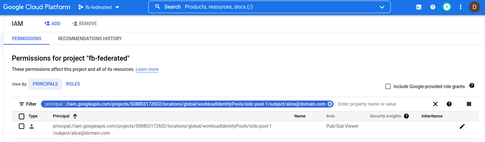

## Federating Firebase to Google Cloud APIs

Tutorial that enables the use of a [Firebase Tokens](https://firebase.google.com/docs/auth/admin/verify-id-tokens) to authenticate to Google Cloud APIs.

If you use `Firebase`, the authentication token you recieve is not directly usable with generic GCP APIs.  While there are exceptions (eg, [Firebase Storage == Cloud Storage](https://firebase.google.com/docs/storage),  [Firebase Functions == Cloud Functions](https://firebase.google.com/products/functions), and ofcourse [Firebase Realtime Database == Cloud Datastore (native mode)](https://firebase.google.com/docs/database)), you cannot use that token directly with any other GCP service since GCP uses its own oauth2 token.

However, GCP now support OIDC Federation (see [Understanding workload identity federation](https://blog.salrashid.dev/articles/2021/understanding_workload_identity_federation/)).  What that allows you to do is use GCP's `Security Token Service (STS)` to exchange an OIDC token for one that is usable against several GCP services.

Basically

* you have a browser app that uses Firebase for authentication. 
* you login, firebase gives you a firebase auth token.  
* either
  * a) The browser exchanges the firebase token for another token 
or
  * b) The browser sends that token to a server you run which [verifies the firebase token](https://firebase.google.com/docs/auth/admin/verify-id-tokens).  Once verification is done, the server exchanges the the firebase token for a federated token.  The server returns the federated token to the browser
* The browser use the token from a) or b) to access a GCP Service (eg, `Cloud PubSub API`)

for more information, see

* [Exchange Generic OIDC Credentials for GCP Credentials using GCP STS Service](https://github.com/salrashid123/gcpcompat-oidc)

>> Please note:  this is just a POC.  The whole app does NOT have to much interms of session management, `CSRF`, firebase best practices, webapp best practices, etc.  This is just a POC

##### Workload Identity using Federated vs Service Account Impersonation

To note, GCP workload federation exchanges the users OIDC, Azure, AWS token for a federated token.  The federated token is then used to _impersonate a service account_.  The impersonated service accounts token is then used to access the GCP service.

This tutorial does _not_ involve this second impersonated change....I mean...it can, but I decided not to include it and instead used a service (pubsub) that accepts [OIDC Without Impersonation](https://blog.salrashid.dev/articles/2021/understanding_workload_identity_federation/#oidc-federated).  If you intend to use the exchanged token for any service that does not accept a federated token (meaning most of them), you need to use the federated token and invoke `iamcredentials.generateAccessToken()` api.

---

Anyway, lets get on with it.

### Setup

Select a project to host firebase and the workload federation configuration (these ofcourse can be in different projects)

```bash
export PROJECT_ID=`gcloud config get-value core/project`
export PROJECT_NUMBER=`gcloud projects describe $PROJECT_ID --format='value(projectNumber)'`

gcloud services enable iam.googleapis.com pubsub.googleapis.com firebase.googleapis.com 

export FB_SVC_ACCOUNT=`gcloud iam service-accounts list --format="value(email)" --filter="displayName=firebase-adminsdk"`

# create a service account key
#   you should not do this in production (or at all)...but here we are just taking shortcuts and i'm lazy.
# https://cloud.google.com/iam/docs/best-practices-for-managing-service-account-keys
gcloud iam service-accounts keys create svc_account.json --iam-account=$FB_SVC_ACCOUNT
```

- Enable Identity Platform using UI

- [https://console.cloud.google.com/apis/api/identitytoolkit.googleapis.com](https://console.cloud.google.com/apis/api/identitytoolkit.googleapis.com)

Then configure

* Add Provider:
   * `Email/Password` (uncheck PasswordLess login)
   * `Authorized Domain`: `server.yourdomain.com` (this is the "server" we will run locally)
      * edit `/etc/hosts` and set `127.0.0.1 server.yourdomain.com`  (we're doing this since this tutorial is running locally)


Note the configuration and `API_KEY` for firebase.  In my case, it looked like

```html
<script src="https://www.gstatic.com/firebasejs/8.0/firebase.js"></script>
<script>
  var config = {
    apiKey: "AIzaSyCbIXal_yKpHTe-redacted",
    authDomain: "fb-federated.firebaseapp.com",
  };
  firebase.initializeApp(config);
</script>
```

#### Create Test User using CLI

We'll now create a test user with a weak password:  `alice@domain.com`. 

This is the user which we will login with and configure federation.

```bash
cd cli
export GOOGLE_APPLICATION_CREDENTIALS=`pwd`/../svc_account.json
node create.js
```

- (optional) test Login using CLI:

This new user should now exist...you can test a 'local' login first just to be sure

To do that, edit `login.js` and set the configuration you noted above

In my case it was:

```javascript
var firebaseConfig = {
  apiKey: "AIzaSyCbIXal_yKpHTe-redacted",
  authDomain: "fb-federated.firebaseapp.com",
};
```
Now login and print alice's token

```bash
node login.js  | jq -r '.user.stsTokenManager.accessToken'
```

If you decode the token, it may look like

```json
{
  "name": "alice",
  "isadmin": "true",
  "mygroups": [
    "group1",
    "group2"
  ],
  "iss": "https://securetoken.google.com/fb-federated",
  "aud": "fb-federated",
  "auth_time": 1645449756,
  "user_id": "alice@domain.com",
  "sub": "alice@domain.com",
  "iat": 1645449756,
  "exp": 1645453356,
  "email": "alice@domain.com",
  "email_verified": true,
  "firebase": {
    "identities": {
      "email": [
        "alice@domain.com"
      ]
    },
    "sign_in_provider": "password"
  }
}
```

#### Configure Workload Federation

Now configure workload federation for an OIDC provider.

Firebase just happens to act as a very basic OIDC provider:

For example, goto 

- `https://securetoken.google.com/$PROJECT_ID/.well-known/openid-configuration`

you should see a standard discovery endpoint for OIDC

```bash
gcloud iam workload-identity-pools create oidc-pool-1 \
    --location="global" \
    --description="OIDC Pool " \
    --display-name="OIDC Pool" --project $PROJECT_ID

gcloud iam workload-identity-pools providers create-oidc oidc-provider-1 \
    --workload-identity-pool="oidc-pool-1" \
    --allowed-audiences=$PROJECT_ID \
    --issuer-uri="https://securetoken.google.com/$PROJECT_ID/" \
    --location="global" \
    --attribute-mapping="google.subject=assertion.sub,attribute.isadmin=assertion.isadmin,attribute.aud=assertion.aud" \
    --attribute-condition="attribute.isadmin=='true' && attribute.aud=='$PROJECT_ID'" --project $PROJECT_ID

# NOTE, in this specific tutorial, we will _not_ enable impersonation,
## eg, we will skip over 
# gcloud iam service-accounts create oidc-federated
# gcloud iam service-accounts add-iam-policy-binding oidc-federated@$PROJECT_ID.iam.gserviceaccount.com \
#    --role roles/iam.workloadIdentityUser \
#    --member "principalSet://iam.googleapis.com/projects/$PROJECT_NUMBER/locations/global/workloadIdentityPools/oidc-pool-1/attribute.isadmin/true"
```


#### Create GCP Resource and Enable IAM

Create a Resource and IAM binding that supports federated tokens (eg `iamcredentials`, `gcs`, `pubsub`).  In this tutorial, we will use pubsub

```bash
gcloud pubsub topics create topic1

gcloud projects add-iam-policy-binding $PROJECT_ID \
    --member "principal://iam.googleapis.com/projects/$PROJECT_NUMBER/locations/global/workloadIdentityPools/oidc-pool-1/subject/alice@domain.com" \
    --role roles/pubsub.viewer
```

Note that with  IAM binding here, we are applying the federated Identity to the resource (and again, a handful resource types are currently support that format).



#### Configure Webapp

We're now ready startup the app app:

Edit `main.py` and set the values you have for `PROJECT_ID` and `PROJECT_NUMBER`

```bash
PROJECT_ID="fb-federated"
PROJECT_NUMBER="508803172602"
```

Start the webserver

```bash
cd server
python main.py
```


#### Login

Open up an _incognito browser_ and goto [https://server.yourdomain.com:38080/](https://server.yourdomain.com:38080/)

Login as `alice@domain.com`/`Password1`

What you should see is a couple of bit of output:

* `id_token`: the firebase id token
* `server_sts_token`: the GCP STS token as exchanged by the python webserver
* `client_sts_token`: the GCP STS token as exchanged by the client/browser issued token
* `server_pubsub_topics`: the GCP api call using the server-issued token
* `client_pubsub_topics`: the GCP API call using the client/browser issued token


---


Well, thats it...you've now used a generic firebase token to access GCP


---

#### Appendix

#####  CORS

Note that GCP APIs support CORS which allows us to invoke the STS and target google api using this technique

```bash
curl -v  -H "Origin: https://server.yourdomain.com:38080/" \
    -H "Access-Control-Request-Method: POST"  \
    -H "host: sts.googleapis.com" -X OPTIONS  https://sts.googleapis.com/v1beta/token

< HTTP/2 200 
< access-control-allow-origin: https://server.yourdomain.com:38080/    
< access-control-allow-methods: DELETE,GET,HEAD,OPTIONS,PATCH,POST,PUT
< access-control-max-age: 3600
```

```bash
curl -vk  -H "Origin: https://server.yourdomain.com:38080/" \
        -H "Access-Control-Request-Method: GET"  -H "Access-Control-Request-Headers:  Authorization" \
        -H "host: pubsub.googleapis.com" -X OPTIONS  https://pubsub.googleapis.com/v1/projects/$PROJECT_ID/topics

< HTTP/2 200 
< access-control-allow-origin: https://server.yourdomain.com:38080/
< access-control-allow-methods: DELETE,GET,HEAD,OPTIONS,PATCH,POST,PUT
< access-control-allow-headers: Authorization
< access-control-max-age: 3600
```

##### Firebase Custom Token

Note, you cannot _directly_ use a [Firebase Custom Token](https://firebase.google.com/docs/auth/admin/create-custom-tokens) for authentication.  This is because the custom token is issued by the firebase service account and not Firebase itself.

That is, the JWT for a custom token may look like:

```json
{
  "alg": "RS256",
  "typ": "JWT",
  "kid": "ca8e77a7b85d8bfe42df6c1ccda73a3ef23bbde5"
}
{
  "iss": "firebase-adminsdk-d4jcp@fb-federated.iam.gserviceaccount.com",
  "sub": "firebase-adminsdk-d4jcp@fb-federated.iam.gserviceaccount.com",
  "aud": "https://identitytoolkit.googleapis.com/google.identity.identitytoolkit.v1.IdentityToolkit",
  "uid": "alice@domain.com",
  "iat": 1645450237,
  "exp": 1645453837,
  "claims": {
    "premiumAccount": true,
    "role": "foorole"
  }
}
```

However, if you login using that token with [signInWithCustomToken()](https://firebase.google.com/docs/auth/web/custom-auth#authenticate-with-firebase), the resulting token can be used with this flow